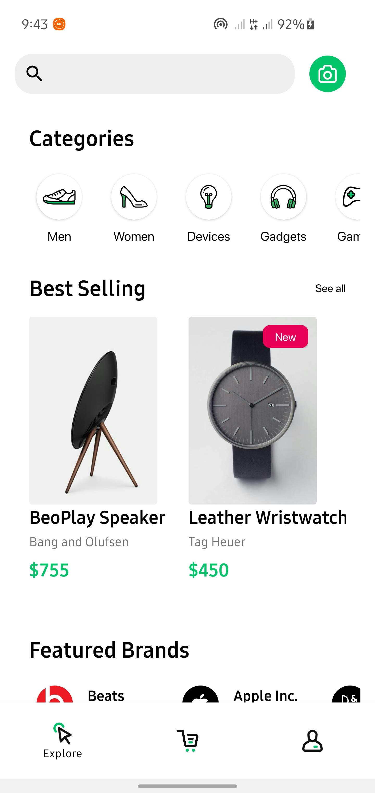
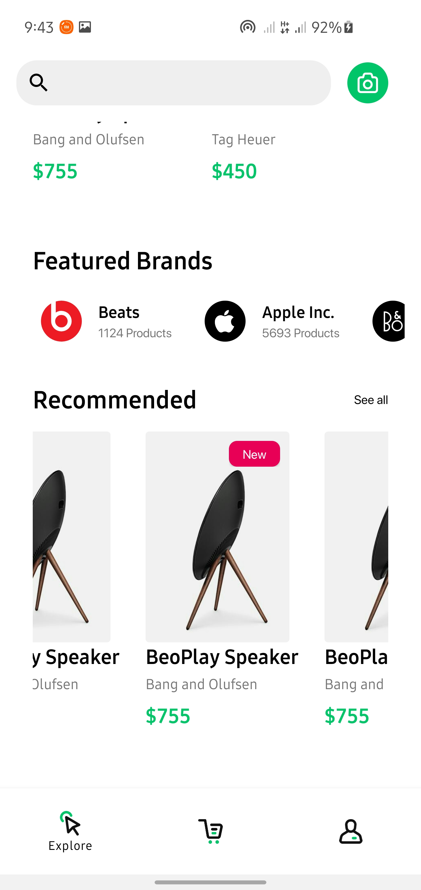
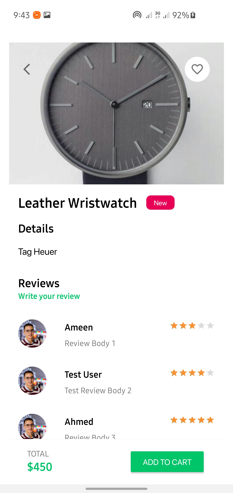
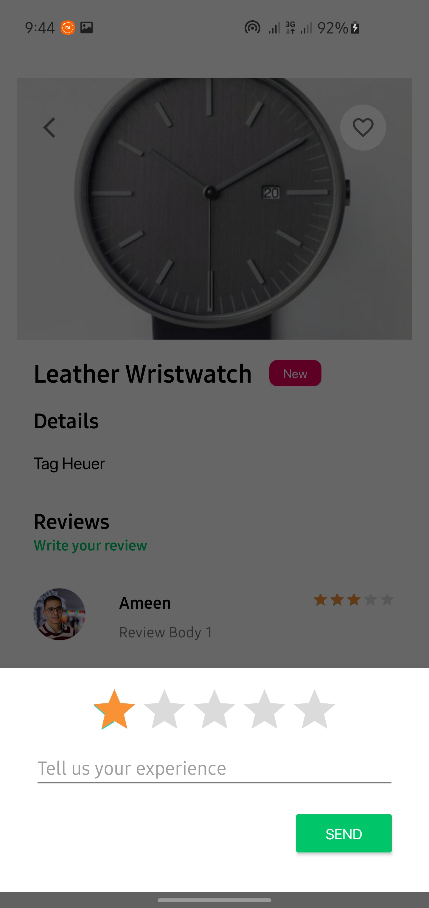
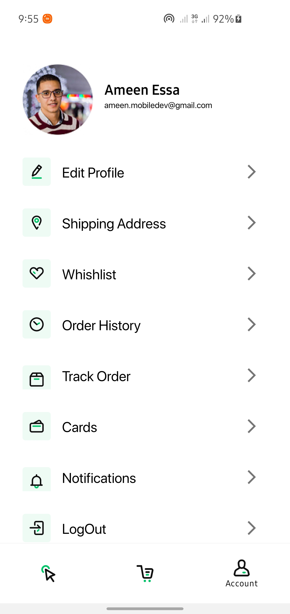
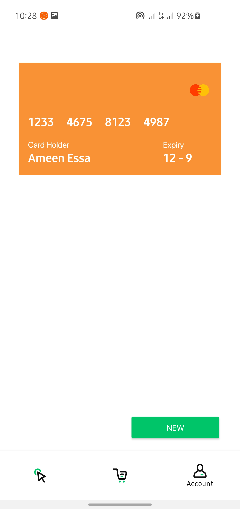
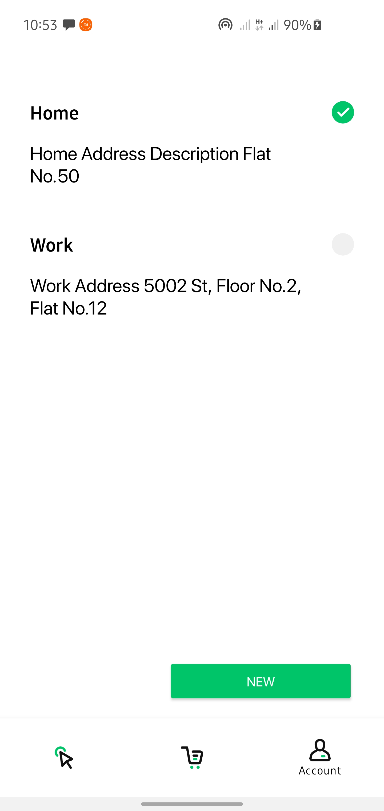

# E-Store
A Simple E-Commerce App 📱 built to demonstrate the use of modern android architecture component with MVVM Architecture 🏗. *Made with love ❤️ by [AmeenEssa](https://github.com/AmeenAhmed1)*

<br />

## UI Design 🎨

***Click to View Commerce app Design from below 👇*** <br/>
[](https://www.behance.net/gallery/74658777/E-Commerce-UI-Kit-FREE)

<br />

## Screens
Explore | Explore-Scroll | Details | Review | Account | Cards | Address
--- | --- | --- | --- | --- | --- | ---
 |  |  |  |  |  | 
<br />


## Built With 🛠
- [Kotlin](https://kotlinlang.org/) - First class and official programming language for Android development.
- [Coroutines](https://kotlinlang.org/docs/reference/coroutines-overview.html) - For asynchronous and more..
- [Android Architecture Components](https://developer.android.com/topic/libraries/architecture) - Collection of libraries that help you design robust, testable, and maintainable apps.
  - [LiveData](https://developer.android.com/topic/libraries/architecture/livedata) - LiveData is an observable data holder class. Unlike a regular observable, LiveData is lifecycle-aware, meaning it respects the lifecycle of other app components.
  - [ViewModel](https://developer.android.com/topic/libraries/architecture/viewmodel) - Stores UI-related data that isn't destroyed on UI changes.
  - [Room](https://developer.android.com/topic/libraries/architecture/room) - SQLite object mapping library.
  - [Jetpack Navigation](https://developer.android.com/guide/navigation) - Navigation refers to the interactions that allow users to navigate across, into, and back out from the different pieces of content within your app
  - [DataStore](https://developer.android.com/topic/libraries/architecture/datastore) - Jetpack DataStore is a data storage solution that allows you to store key-value pairs or typed objects with protocol buffers. DataStore uses Kotlin coroutines and Flow to store data asynchronously, consistently, and transactionally.
- [Material Components for Android](https://github.com/material-components/material-components-android) - Modular and customizable Material Design UI components for Android.
- [AdobeXd](https://helpx.adobe.com/xd/get-started.html) - AdobeXd is a vector graphics editor and prototyping tool.

<br />

## Architecture 🗼
This app uses [***MVVM (Model View View-Model)***](https://developer.android.com/jetpack/docs/guide#recommended-app-arch) architecture.


## Contribute 🤝
If you want to contribute to this app, you're always welcome!

<br>

## Contact 📩
Have an project? DM us at 👇

Drop a mail to:- ameen.mobiledev@gmail.com

<br>

<br />

## License 🔖
```
    MIT License

    Copyright (c) 2021 Ameen Essa

    Permission is hereby granted, free of charge, to any person obtaining a copy
    of this software and associated documentation files (the "Software"), to deal
    in the Software without restriction, including without limitation the rights
    to use, copy, modify, merge, publish, distribute, sublicense, and/or sell
    copies of the Software, and to permit persons to whom the Software is
    furnished to do so, subject to the following conditions:

    The above copyright notice and this permission notice shall be included in all
    copies or substantial portions of the Software.

    THE SOFTWARE IS PROVIDED "AS IS", WITHOUT WARRANTY OF ANY KIND, EXPRESS OR
    IMPLIED, INCLUDING BUT NOT LIMITED TO THE WARRANTIES OF MERCHANTABILITY,
    FITNESS FOR A PARTICULAR PURPOSE AND NONINFRINGEMENT. IN NO EVENT SHALL THE
    AUTHORS OR COPYRIGHT HOLDERS BE LIABLE FOR ANY CLAIM, DAMAGES OR OTHER
    LIABILITY, WHETHER IN AN ACTION OF CONTRACT, TORT OR OTHERWISE, ARISING FROM,
    OUT OF OR IN CONNECTION WITH THE SOFTWARE OR THE USE OR OTHER DEALINGS IN THE
    SOFTWARE.

```
